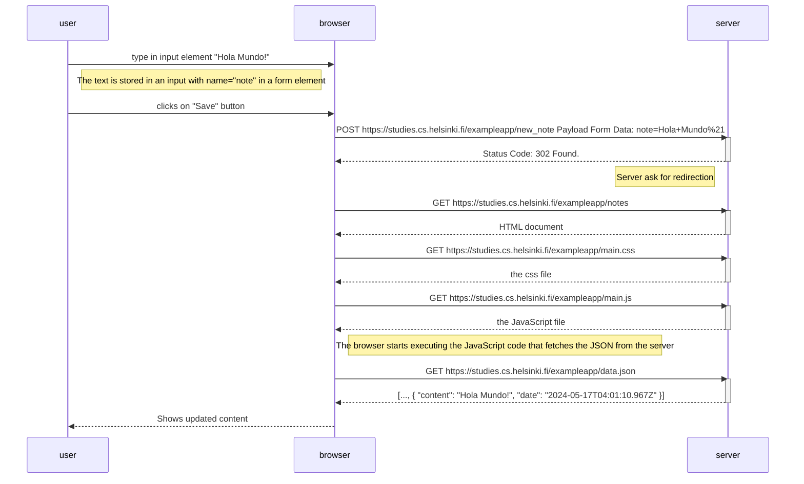

```mermaid
sequenceDiagram
    participant user
    participant browser
    participant server

    user->>browser: type in input element "Hola Mundo!"
    Note left of browser: The text is stored in an input with name="note" in a form element

    user->>browser: clicks on "Save" button

    browser->>server: POST https://studies.cs.helsinki.fi/exampleapp/new_note Payload Form Data: note=Hola+Mundo%21
    activate server
    server-->>browser: Status Code: 302 Found. 
    deactivate server
    Note left of server: Server ask for redirection

    browser->>server: GET https://studies.cs.helsinki.fi/exampleapp/notes
    activate server
    server-->>browser: HTML document
    deactivate server

    browser->>server: GET https://studies.cs.helsinki.fi/exampleapp/main.css
    activate server
    server-->>browser: the css file
    deactivate server

    browser->>server: GET https://studies.cs.helsinki.fi/exampleapp/main.js
    activate server
    server-->>browser: the JavaScript file
    deactivate server

    Note right of browser: The browser starts executing the JavaScript code that fetches the JSON from the server

    browser->>server: GET https://studies.cs.helsinki.fi/exampleapp/data.json
    activate server
    server-->>browser: [..., { "content": "Hola Mundo!", "date": "2024-05-17T04:01:10.967Z" }]
    deactivate server

    browser-->>user: Shows updated content
    
```
