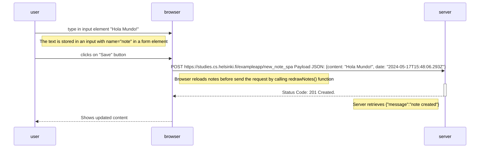

```mermaid
sequenceDiagram
    participant user
    participant browser
    participant server

    user->>browser: type in input element "Hola Mundo!"
    Note left of browser: The text is stored in an input with name="note" in a form element

    user->>browser: clicks on "Save" button

    browser->>server: POST https://studies.cs.helsinki.fi/exampleapp/new_note_spa Payload JSON: {content: "Hola Mundo!", date: "2024-05-17T15:48:06.293Z"}
    Note right of browser: Browser reloads notes before send the request by calling redrawNotes() function
    activate server
    server-->>browser: Status Code: 201 Created. 
    deactivate server
    Note left of server: Server retrieves {"message":"note created"}

    browser-->>user: Shows updated content
```
